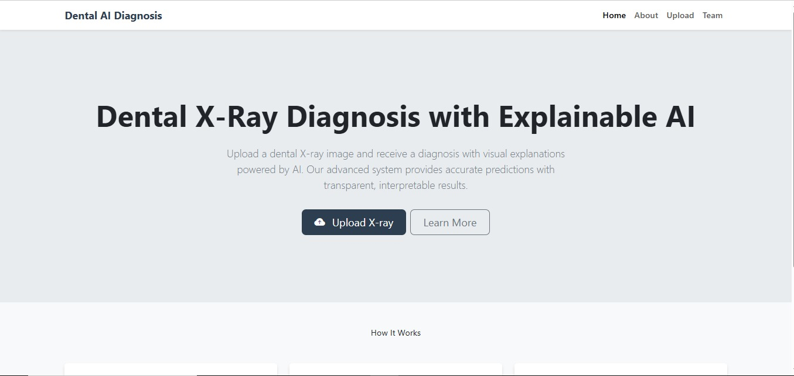

# 🦷 Dental X-Ray Diagnosis and Visualization with Explainable AI

## 📌 Project Overview

This project focuses on building a smart dental diagnostic system that uses **deep learning** and **explainable AI** to classify dental X-ray images. The goal is to help dental professionals by automating cavity detection and visualizing how the model makes decisions using techniques like **Grad-CAM**.

The system accepts dental X-ray images, classifies them ("Healthy Teeth" or "Unhealthy Teeth"), and returns both the prediction and a heatmap indicating the region of interest. [Watch the live demo](https://drive.google.com/file/d/1sZEcJUYynnIG0d-j7VbRLou-Of5xIjlf/view?usp=drive_link)

<div align="center">
  
</div>
<div align="center">
  
</div>

---

## 🎯 Objectives

- Collect and preprocess dental X-ray datasets. [Dataset](https://drive.google.com/file/d/1olZweNe-GEKNhceDcuQ0iRyNiysTlUUK/view?usp=drive_link)
- Train a convolutional neural network (CNN) for accurate classification.
- Apply **Grad-CAM** to explain model predictions.
- Build an API to serve predictions and heatmaps.
- Develop a web-based interface to interact with the system.

---

## 🛠️ Technologies Used

**Languages & Libraries**:
- Python, PHP, HTML/CSS

**Data Processing**:
- OpenCV, Pillow, NumPy, Pandas, matplotlib

**Modeling**:
- TensorFlow/Keras or PyTorch, sklearn

**Explainability**:
- Grad-CAM (Keras / PyTorch), NumPy

**Backend**:
- Flask, FastAPI, Gunicorn, JSON, Laravel

**Frontend**:
- HTML / CSS / Bootstrap / TailwindCSS, Axios / Fetch API

**Deployment**:
- Streamlit, Flask server, Docker, AWS

---

## 🖥 Deep Learning Model Selection

✅ Our Choice: ResNet50

We adopted ResNet for this project because it offers a balance of accuracy, efficiency, and robustness when working with medical images like dental panoramic X-rays. Its residual connections allow deep feature extraction, making it well-suited for detecting subtle dental abnormalities.

<div align="center">
  
</div>

---

## 👨‍👩‍👧‍👦 Team Members

| Name                     | Reg No     |
|--------------------------|------------|
| **I.S. Siriwardana** | 22UG1-0522 |
| **J.S. Dharmadasa** | 22UG1-0557 |
| **S.P.A.S. Senarathne** | 22UG1-0345 |
| **H.A.K. De Zoysa** | 22UG1-0496 |
| **K.G.V.T. Gamage** | 22UG1-0392 |
| **H.M.K.S. Dedunupitiya**| 22UG1-0812 |
| **B.K.G. Perera** | 22UG1-0506 |
| **G.K.S. Fernando** | 22UG1-0379 |
| **G.K.S. Pathum** | 22UG1-0520 |
| **S. Yugadharshini** | 22UG1-0289 |
| **U.V.C.T. Jayathilaka** | 22UG1-0380 |

---

## 📝 Work Done

### Model Architecture and Experiments
- **EfficientNetB3 Model:** An initial model was built using EfficientNetB3 as a base. It was trained and fine-tuned on the dental X-ray dataset.
- **ResNet50 Model:** An alternative model was built using ResNet50. This model was also trained and fine-tuned for comparison.
- **Hyperparameter Tuning:** Experiments were conducted with different optimizers (Adam, SGD) and learning rates to improve model performance, especially recall for the positive class.
- **Class Imbalance:** To address class imbalance in the dataset, class weights were calculated and applied during the training of the ResNet50 model.

### Explainable AI (XAI)
- **Grad-CAM Implementation:** Grad-CAM was implemented to generate heatmaps that visualize the regions of the X-ray images that most influenced the model's prediction.
- **Visualization:** Functions were created to overlay the Grad-CAM heatmaps onto the original images, providing an interpretable explanation of the AI's decision-making process.

### Web Interface
- **Prediction Controller:** A `PredictionController` in Laravel was created to handle image uploads, call the prediction service, store results in the session, and display them on the `dental-ai.blade.php` view.
- **PDF Report Generation:** Functionality was added to generate a PDF report of the diagnosis results, including the original X-ray, the Grad-CAM heatmap, and prediction details.
- **Frontend Enhancements:** The buttons on the web interface were aligned for better user experience.

---

## ▶️ How to Start the Project

This project requires both a Laravel frontend-backend and a Python flask API. Follow these steps to get the entire system running.

#### 1. Setup the Python Backend

1.  **Clone the Model Repository:** The `new_efficientnet_dentalAI_model.h5` and `app.py` files are located in the `master` branch model folder. Clone them into your project directory.

2.  **Setup the Python Environment:** Navigate to the new `model` folder and create a Python virtual environment to manage dependencies.

    ```bash
    cd model
    python -m venv venv
    source venv/bin/activate  # On Windows, use: venv\Scripts\activate
    ```

3.  **Install Dependencies:** Install all the required Python libraries for the AI model and backend API (e.g., Flask, TensorFlow).

    ```bash
    pip install tensorflow Flask Pillow numpy matplotlib
    ```

4.  **Run the Backend Server:** Start the backend server, which will be running on `http://127.0.0.1:5001`.

    ```bash
    python app.py
    ```

#### 2. Setup the Laravel Frontend

1.  **Install PHP Dependencies:** Open a new terminal window in the root of your project and install the Composer dependencies.

    ```bash
    composer install
    ```

2.  **Set up the Database:** If your project uses a database, configure your `.env` file and run the migrations.

    ```bash
    php artisan migrate
    ```

3.  **Serve the Application:** Start the Laravel development server.

    ```bash
    php artisan serve
    ```

4.  **Access the Application:** Open your web browser and navigate to `http://127.0.0.1:8000` to access the web interface.


📁 Project Structure

dental-xray-ai/
├─ model/
│  ├─ app.py                 # Flask/FastAPI backend for predictions + Grad-CAM
│  ├─ new_efficientnet_dentalAI_model.h5
│  ├─ resnet50_model.h5
│  ├─ utils/
│  │  ├─ preprocessing.py
│  │  ├─ gradcam.py
│  │  └─ inference.py
│  └─ requirements.txt
├─ web/                      # Laravel app
│  ├─ app/Http/Controllers/PredictionController.php
│  ├─ resources/views/dental-ai.blade.php
│  ├─ routes/web.php
│  └─ ...
├─ data/
│  ├─ train/healthy | unhealthy
│  ├─ val/healthy   | unhealthy
│  └─ test/healthy  | unhealthy
├─ notebooks/
│  ├─ 01_exploration.ipynb
│  ├─ 02_train_resnet50.ipynb
│  └─ 03_eval_gradcam.ipynb
├─ docs/                     # Exported PDF samples, screenshots, reports
├─ .env.example              # Laravel env template
├─ .env.model.example        # Python API env template
└─ README.md

